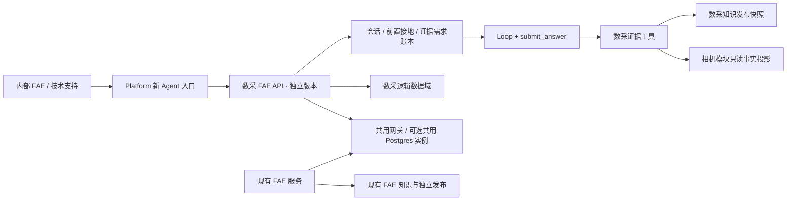

# 数采 FAE 完整设计

**状态**：v0.2，已纳入实施前评审核查；本地空知识 Dev 启动版已开始，完整里程碑 0、接入和上线尚未完成。
**日期**：2026-10-08。
**方案**：B，独立数采 FAE 实例；复用受版本约束的通用代码，数采知识独立发布和回滚。独立数据库服务器、独立模型网关额度并非业务要求。
**基线**：2026-10-08 只读核查已确认现有 FAE 生产 `/health`、当前发布包 `build-info.json` 与成功发布 manifest 均指向 `a6234f6be546efebb230ffc74bd9a00bebdc2814`；详见 [上游发布基线核查](reviews/2026-10-08-upstream-fae-baseline-audit.md)。这份代码确实已部署，但该提交未落 `master`、没有 tag，仅由 `feat/gemini-materials-20261008` 和设计分支可达，不能直接作为持久源码依赖。实施时须把包含通用注入点和身份参数化的最终上游提交落到受保护分支或不可改写 tag 后再锁定。此前需求、产品盘点和 A/B 决策见相邻 `AI-FAE-Agent` 仓库的 `docs/superpowers/specs/2026-10-08-data-acquisition-fae-requirements.md`、`docs/architecture/数采产品与资料盘点_20261008.md`、`docs/superpowers/specs/2026-10-08-data-acquisition-fae-options-design.md`，设计提交为 `881c1491c2e47fd2aa0452f66381966ea661170a`，盘点口径修订提交为 `972852ad6cdc93dc7a5cea439d66ca35d847b684`。两者已推送到 FAE 远端 `docs/data-acquisition-fae-design-20261008` 分支；分支保护规则尚未核实。

## 1. 决策、目标与首期范围

首期服务内部 FAE 和技术支持。现有 FAE 实际供天猫客服与渠道使用，未直接开放终端客户；数采 Agent 后续向哪些相同角色开放，由资料可见性和试点结果决定。最重要的约束是**数采迭代不得损害现有 FAE 的回答质量**。因此分开运行版本、知识发布和回滚；资源可共用，但须能发现共用资源造成的延迟或错误。数采服务本身也须给出专业、有据、能继续排障的答案。

首期问题覆盖产品识别和变体消歧、规格、设备组合与连接、采集与落盘流程、Viewer/SDK/固件的版本关系、日志/图片排障及多轮追问。对 EGO 双目两种配置、EGO Pro、EGO + 双 WristCam + HUB，有资料支撑的范围内可提供操作建议；UMI Finger、UMI 视觉模块、EG-DB 和 HUB 单品先以已核验的身份与规格为主。资料里缺失的多机步骤、未核验的软件兼容性、冲突参数不得补编。终端客户自助、跨助手自动共享会话、二进制自动分发不属首期交付。

**设计完成与可上线是两件事**：本设计可以指导开发；有争议的产品事实和资料使用范围未确认前，相应字段或文件不得作为确定答案/下载入口。可以先开发证据治理和 Dev 服务，但不能把未裁决内容交付给试点用户。

## 2. 运行架构



数采与现有 FAE 是两个应用入口、两个运行版本、两份知识发布清单、两个回滚目标。首期可共用同一物理 Postgres 和模型网关，但数采使用**单独数据库与数据库用户**、独立附件目录和独立 trace/反馈域，避免会话及知识交叉读取。共用资源容量和故障仍是共同风险，不能宣称完全故障隔离。现有 FAE 的生产配置、知识索引与入口不因数采知识发布而改变。

### 2.1 代码复用与新目录

`AI-DAQ-FAE-Agent` 已在现有仓库的同级目录初始化为独立 Git 仓库（`main`，本地基线 `9eab3f9`，尚未配置远端）。独立仓库采用固定 SHA 的上游 FAE 源码依赖（优先 Git submodule），构建清单同时记录上游 SHA、数采仓库 SHA、知识快照 SHA、模型/提示版本和镜像 digest；不通过浮动分支或构建时抓取最新版。上游 SHA 必须由受保护的持久 Git ref 保持可取得，并在构建中验证检出结果；单靠当前可被改写的特性分支不满足这一条件。不能长期复制一份不再同步的 FAE 源码。

| 边界 | 首期做法 | 现状与必要工作 |
| --- | --- | --- |
| Provider Adapter、模型重试、终稿协议、附件安全与 trace 基础件 | 从固定上游 SHA 复用；数采保持自己的配置和测试 | 现有 `src/agent/loop/`、`src/attachments/`、`src/agent/tracing.py` 可作为复用候选，须做接口/版本合同测试 |
| 应用装配、实体/任务 schema、会话扩展、证据工具与知识 | 在数采项目实现 | 现有 `src/api/server.py` 启动时加载相机专用事实；`Orchestrator` 固定构造相机 `ToolBox`，不能直接换环境变量当成数采服务 |
| Loop 证据门 | **先在现有 FAE 仓实现**窄的 `EvidencePolicy` 注入点，现有 FAE 默认行为不变；数采实现自己的需求账本与终稿门 | 当前 `LoopRuntime` 没有该注入点；数采证据门依赖它，是里程碑 0 的硬依赖。相机 `filter_models`、系列、SDK 门保留，旧 FAE 须过回归 |
| 身份和 Platform Task 合同 | **先在现有 FAE 仓参数化数采实际复用的身份与任务组件**；新 `agent_id` 按 HTTP Task v1 接入 | 当前身份校验、任务 audience 和能力声明固定为 `ai-fae-agent`；必须验证两服务互不接受对方的会话、反馈、授权和任务 token |
| 数采知识与提示 | 仅由本项目版本化发布 | 不在现有 `Knowledge/` 中投放数采候选文件，不共享可写索引 |

数采项目建议目录：`daq_fae/`（应用与域代码）、`knowledge/`（经治理文本和关系）、`prompts/`、`contracts/`、`evals/`、`deploy/`、`docs/`、`upstream/ai-fae-core/`（固定版本源码依赖）。当前 FAE 的 `pyproject.toml` 只声明项目名和工具配置，并没有可直接依赖的独立内核包；实施时先做可复核的固定源码依赖及窄接口合同，不把“共享内核包已存在”当作前提。`EvidencePolicy` 和身份组件的上游兼容变更须先在现有 FAE Dev 通过旧域回归及双仓合同测试，固定其受保护 Git ref 后，数采才可更新依赖 SHA；现有 FAE 的生产发布单独审批和验证。

身份硬编码审计范围：`src/platform_identity/client.py` 的验证请求及响应校验、`service.py` 的 subject 校验、`src/platform_tasks/routes.py` 的能力声明、`src/api/server.py` 的任务 audience 是数采接入相应协议前必须参数化的入口，默认值继续保持旧 FAE 身份。`src/attachments/archive_models.py` 的归档/删除 manifest 与 `src/production_analytics/platform_publication.py` 的报告来源也写死旧 ID；这两项不能在数采侧原样复用。若首期启用附件归档或报告发布，必须先参数化并通过两服务合同测试；若未启用，则在数采构建和运行配置中显式排除，并在启用前补完。身份、反馈、会话及任务的跨 Agent 拒绝测试均属里程碑 0。

数采实现自己的应用装配，不直接调用当前硬连相机知识的 `src.api.server.create_app()` 或整个 `Orchestrator`。数采 `ToolBox` 对共享 `LoopRuntime` 提供 `with_request_context(question)`、`tool_schemas()`、`dispatch(name, arguments) -> ToolResult`、`redact_tool_input()`、附件来源与视觉模型属性；不启用相机专有的 `filter_models`、系列和设备支持要求。沿用 `official_links`、`sdk_evidence` 这些受运行时识别的工具名，并在含 URL 的回答前**实际调用工具取得本轮已核验 URL**；现有运行时的 URL 门无条件检查终稿中的链接，只有工具名而没有本轮返回的 URL 仍不能通过。共享 `LoopRuntime` 的新 `EvidencePolicy` 只接收通用账本和工具结果，返回放行、补证或明确拒绝；现有 FAE 使用保持既有行为的默认策略。接口合同测试须证明固定上游 SHA 对两套应用都适用。

首期数采 Dev 模型配置以现有已验证的 Opus 5.5 Anthropic 网关协议为起点，主模型使用 adaptive/high 与 `submit_only_auto`；不得对该模型发送 forced `tool_choice`。数采模型、提示、网关参数独立于现有 FAE 版本锁定，任何替换先经过数采真实 Dev 回放。GLM 不进入数采首期回答路径，也不作为独立答案质量复审者。

### 2.2 入口、身份与数据

新 Agent 标识建议为 `ai-daq-fae-agent`。Platform 注册新卡片和独立入口，身份绑定须携带该 Agent ID；原 `ai-fae-agent` 会话、反馈和授权不得被新服务接受。数采 API 保留 `/chat` 流式响应、`/attachments`、`/feedback`、`/health` 等现有交互语义，支持 `client_request_id` 去重和 SSE 心跳；终态事件附带 `agent_id`、`knowledge_release`、`runtime_release` 供追踪。断线重连不能悄悄重复执行同一问题或把半截输出当成完整答案。接入 Platform 任务流时遵守 `orbbec-http-task/v1`，使用新 audience 和能力声明，不能只改前端名称。若首期只开 WebUI/API，任务流可在独立里程碑接入，但任何 Platform 入口都必须先完成身份/合同验证。

身份、资料权限、反馈、会话和附件必须 fail closed：无法确认当前用户是否有该 Agent 或资料类别的访问权时，不提供资料正文或下载链接。现有 Platform `subject_type` 仅区分企业成员与合作方，不能代替数采资料的细分权限；必须另有 Agent 绑定及资料类别 entitlement，或试点期间受控的内部 FAE 名单。天猫客服与渠道的开放须依角色表和资料发布口径。终端客户默认不可见。用户日志、图片和录制样本只作为当前会话证据，沿用附件过期与归档边界，不自动进入官方产品知识。

资料可见性须在**检索与工具返回前**按身份过滤，不能把保密段落交给模型后只靠终稿删掉。`sources`、trace 和反馈持久化只记可审计的来源 ID、范围与脱敏摘要；附件原文和含凭据的链接不进入普通日志。身份绑定或角色映射缺失时返回授权/配置错误，不把它误判为数采知识缺证。

## 3. 数采领域模型与知识发布

### 3.1 必须治理的实体与关系

| 类型 | 最小字段 / 关系 | 约束 |
| --- | --- | --- |
| 产品实体 | `entity_id`、系列/整机/变体/组件/套件、别名、生命周期、SKU/修订、来源 | EGO 1600/1920、EGO Pro、EG-DB、WristCam、UMI、HUB 不能凭相似名称合并 |
| 规格主张 | `claim_id`、实体、字段、值、单位、测量条件、适用版本、来源定位、状态 | `verified / conflict / unknown / unsupported` 分开；无资料不等于不支持 |
| 组合拓扑 | 主从角色、端口、线材、供电、平台、同步对象、存储位置、组合版本 | 单机指南不能推导多机组合；组件规格不能推导套件端到端性能 |
| 操作流程 | 前提、适用组合/版本、顺序步骤、每步检查点、失败分支、风险 | 只发布资料与产品负责人确认的步骤；未完章节保持不可答 |
| 软件关系 | 产品/修订、平台、连接模式、Viewer、SDK、固件、功能、验证状态 | 软件包存在、代码接口存在、设备支持、端到端验证是不同事实 |
| 交付入口 | URL/文件标识、页面核验、资料类型、可查看角色、可转发角色、有效期 | 包名与本地路径不是官方下载链接；未核验入口不输出 |

首批来源是相邻 FAE 仓库的 `tmp/数据采集设备资料汇总-20260920(1)/` 快照。核查时 `tmp/` 只是 Git 未跟踪目录，原 `.gitignore` 没有规则，存在误提交风险；设计分支已新增根目录 `/tmp/` 忽略规则，主工作树当前另有本地 `.git/info/exclude` 保护，仍须把版本化规则合入 `master`。原始快照为 1,990,976 KiB（约 1.90 GiB；其中开发工具包约 1.8 GiB），与包含其他内容的整个 `tmp/` 目录大小不是同一口径。里程碑 0 须保留原始包的受控、只读、仓外归档位置和文件 SHA-256 清单，校验归档可重取；归档完成前不得删除唯一原件或把它作为可重建的发布输入。原包只作候选输入：记录文件哈希、版本、语言、页/章节、日期和来源类型，抽取后由负责人裁决，再生成只读的知识发布快照。二进制仅保留元数据和受控下载关系，不进入文本索引。在线请求不临时从 `tmp/`、飞书或不受控网络抓取资料。

每次发布须生成不可变 `knowledge_release` 清单：来源文件哈希、事实/关系数量、冲突和缺证清单、裁决人及时间、可见角色、链接核验记录、静态审计结果、Dev 回放批次及前一版本。发布是快照切换；失败时回滚到上一快照，不用线上手改事实。对同一实体/字段/条件的新旧值冲突，编译阶段标记 `conflict` 并阻断该字段的确定性回答，其他已核验字段可继续使用。

冲突记录保留候选值而不覆盖旧值。例如 EGO Pro 与官网 Quad-EGO 的关系未确认时，`entity_id`、`field_id`、硬件修订、测量条件、各候选值、各自 `source_id` 和 `adjudication=pending` 同时存在。只有确认 SKU/修订映射并记录裁决人后，才能发布 `verified` 值；不能靠来源日期、语言或文件名自动胜出。

### 3.2 内嵌模块与跨域边界

EG-DB 来源描述包含 Gemini 335L 深度模块。数采知识发布可引用一份**固定版本、只读的相机模块事实投影**：投影记录原 FAE 的来源 ID、版本、适用模块型号/硬件修订及再发布审计；数采服务无权修改原 FAE 事实。只有经确认的“该整机包含该模块”关系成立时，才能把模块标称参数作为模块信息回答。模块标称精度不能自动写成 EG-DB 整机精度；同步、功耗、SDK 和录制能力仍须整机/组合证据。真正需要比较独立相机产品和数采系统的联合结论，首期明确证据边界并交人工 FAE；不可把所有 EG-DB 问题都转人工。

### 3.3 资料裁决与角色表

事实裁决与资料使用许可分开记录。产品/研发负责人确认 SKU 映射、参数、版本和组合操作；资料所有者或渠道负责人确认规格书、内部指南、SDK、固件与链接分别允许内部 FAE、天猫客服、渠道查看/转发的范围。两者可以是不同人。当前这些负责人尚未指定；实施时可先建设候选库和 Dev 回放，但未裁决的冲突和未授权的交付入口不进入试点可答范围。不要把“全部资料暂不可用”扩大为对所有已核验事实的拒答。

## 4. 请求、取证与终稿协议

```text
channel -> 身份/角色 -> Session context -> guardrail -> 数采 schema/实体接地
        -> 证据需求账本 -> Loop 多轮工具取证 -> 覆盖/冲突门
        -> submit_answer -> 确定性渲染 -> sources/outcome/trace/eval
```

会话保留采集任务、设备组合/变体、主从角色、平台、连接/供电、Viewer/SDK/固件版本、存储/录制格式、已试步骤和错误证据。短追问继承已确认条件；用户换场景时切主题。前置 schema 只抽取可确定的需求，不把用户猜测当产品事实；Loop 根据问题自主补查多种能力，不恢复旧固定 Planner 或单桶路由。

数采工具面至少包括 `resolve_entity`、`lookup_spec`、`inspect_topology`、`lookup_procedure`、`check_software_support`、`search_knowledge`、`sdk_evidence`、`official_links`、`session_state`，以及经授权的附件检索/精读/图片分析。每个结果使用统一状态、内容、结构化来源和可诊断错误。`lookup_procedure` 返回适用条件和检查点，`inspect_topology` 返回组件/连接关系，`check_software_support` 区分已验证、明确不支持和未知。当前 FAE 的相机 `filter_models` 不直接用于采集套件；选型按套件组合约束另建通用判定。

**证据需求账本**在前置阶段记录可确定的需求 ID、能力、实体和条件；每次工具结果记录获得的证据、状态、来源及版本。终稿前输出每个需求的 `satisfied / missing / conflict / unknown`。前置阶段不能判断的需求必须显式 `unknown`，空数组/空对象不能代表覆盖充分。`resolved` 只能基于已满足的关键需求；缺证用 `safe_abstained`，需产品/研发确认用 `escalate_rd`，现场需人接手用 `escalate_fae`。预期弃答与系统失败分别计数。`submit_answer` 仍是唯一可交付终稿；正文自然表述，文件路径与页码保留在结构化 `sources`。

共享 `LoopRuntime` 需要窄的证据门注入点：数采门根据账本阻止无据 `resolved`，在有界重试后给出明确缺口或协议失败；旧 FAE 默认行为保持原样并跑旧域回归。Provider HTTP 400 或工具协议错误按配置/协议失败归因，不伪装成可重试 503；真正上游不可用、超时、预算耗尽、附件处理失败、未授权链接各有独立 outcome、trace 和必要时的 `fallback_used`/`fallback_reason`。任何降级不得无声发生。

每题记录完整问题、答案、计划/实际能力、证据覆盖、来源、fallback、outcome、trace_id、耗时、模型/网关版本和独立复审结论。当前现有 Loop 的 `planned_capabilities=[]`、`capability_coverage={}` 是观测缺口；数采正式发布前必须由账本生成有语义的机器字段，不能用空字段过门。会话及反馈记录包含数采 `agent_id`、`runtime_release`、`knowledge_release`，保证问题可按确切版本复跑。

## 5. Dev 验收与发布门

### 5.1 测试矩阵

| 样本族 | 核心检查 |
| --- | --- |
| 型号/规格 | EGO 1600/1920 和 EGO Pro 消歧；100/120 mm、Wi-Fi 5/6、EG-DB 帧率冲突不被擅自裁决 |
| 组合/流程 | EGO + 双 WristCam + HUB 的接线、供电、配对、同步、短时试录和落盘检查均有适用证据 |
| 缺口/越界 | 未完的 EGO Pro 多设备章节、UMI/EG-DB 缺上手时不编造流程；无资料不写成不支持 |
| 软件/链接 | SDK/Viewer/固件按设备、平台、连接和版本回答；未经核验或未授权的链接不输出 |
| 多轮/附件 | 继承组合、版本与已试步骤，主题切换重置；日志/图片只作当前用户证据 |
| 内嵌模块/跨域 | Gemini 335L 模块参数与 EG-DB 整机能力分开；真正跨产品联合结论有明确转交 |
| 错误/边界 | Provider 400、超时、工具错误、预算、无权访问与业务缺证归因不同；fallback 可见 |

测试集包括核心单轮、多轮上下文、历史失败哨兵、catalog/spec/selection/SDK/troubleshooting/boundary 泛化题。先用静态与合成数据验证实体、关系、权限和终稿门，再在 Dev 对真实模型回放，由 Codex 或人类 FAE 独立复审专业性、依据和可交付性；不使用回答模型自评。对生产只做只读健康和入口检查，不跑评测。评测输出必须包含问题、完整答案、能力/覆盖、fallback、trace、耗时、复审人及失败层级（channel、context、guardrail、schema、Loop、capability evidence、coverage、synthesis、outcome、trace/eval）。

### 5.2 硬门与资源门

首期数采硬门：零严重事实/型号混答、零未经授权的资料/链接交付、零把运行错误误报为业务缺证、零无据 `resolved`；旧 FAE 共享内核或共用资源配置变更须通过受影响路径的核心、上下文、历史哨兵和泛化 Dev 回归，零严重退化。模型、网关、工具、提示和知识各自固定版本。性能记录 p95/p99、Provider/工具调用数、排队、重试与共用资源压力；试点前从现有 FAE 和数采 Dev 回放取得基线并冻结具体上限，不能用“感觉可接受”替代门槛。正式数值是试点批准输入，当前资料不足以写成已验证指标。

## 6. 实施顺序与回滚

1. **里程碑 0：先完成上游与资料安全基线**：独立 Git 仓库已经建立。核对现有 FAE 的真实生产 build SHA 与 release manifest；将选定的上游源码及其 `EvidencePolicy` 注入点、复用的身份/任务组件参数化落到受保护分支或不可改写 tag，固定数采依赖 SHA。旧 FAE Dev 回归和两服务的身份、任务、证据门合同测试通过后，才开始复用该运行时。现有 FAE 生产发布仍单独审批。将设计分支的 `/tmp/` 忽略规则合入旧仓库，并将原始包及哈希清单归档到受控仓外位置，验证可重取。建立数采 CI、构建清单、`agent_id`、Platform 入口与最小权限矩阵。
2. **资料治理**：冻结原始快照，形成实体/字段/拓扑/流程/软件关系和角色可见表；由负责人裁决首批冲突，生成可回滚的只读知识发布；未闭合字段保留缺口。
3. **数采 Dev 服务**：实现独立应用装配、会话和工具、证据账本、终稿门、附件与 trace；只接 Dev 模型/配置。先开受控内部试点入口，暂不开放未授权角色。
4. **真实测试与复审**：运行 §5 测试矩阵，逐题按工作流层归因并修根因；对共享代码/配置变更跑旧域回归和资源测试。冻结试点可答范围、性能上限和回滚演练记录。
5. **试点发布决策**：核对事实裁决和资料使用权、身份合同、完整质量记录、资源门及回滚演练。数采部署按独立镜像 digest 与知识快照发布；旧 FAE 不随数采知识切换。发布后只读验证新入口、后端、Platform/MetaBot 接入及现有 FAE 健康，分别监测。

数采服务须能**单独回滚**：只切换数采镜像与知识快照，并处理对应数采数据库迁移的可逆/兼容步骤；不能用回滚数采服务来掩盖已影响现有 FAE 的共享资源问题，后者须有容量控制或配置回退。每次发布保存构建与知识双版本、检查结果、评测批次和观察窗口。跨仓共享内核升级须分别批准两个实例的发布。

## 7. 尚待确认但不阻断设计的输入

1. **事实与资料负责人**：指定产品/研发的参数及组合裁决人，以及资料所有者/渠道负责人的角色可见/转发口径。未确认项目仍按冲突或缺证处理。
2. **Platform 入口范围**：先 WebUI/API 内测试点，还是首期同时接入钉钉/MetaBot；两者需要独立健康观察。默认先完成受控 WebUI/API 与 Platform 身份，随后接入其他渠道。
3. **性能上限**：以 Dev 实测和现有 FAE 基线在试点前冻结。共用网关和 Postgres 若出现资源争用，再配置限额或扩容。

跨域咨询频率可从现有问答记录做只读统计，供未来评估单入口，不阻塞首期方案 B。以上输入不会改变已选的独立数采实例、独立知识发布与现有 FAE 质量保护目标。
