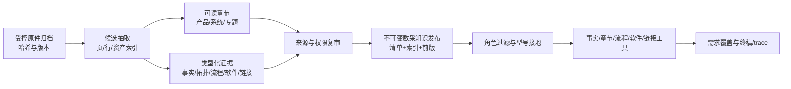

# 数采 FAE 知识库全链路设计

**日期：** 2026-10-10

**状态：** 设计待用户复审；不构成资料签认、知识发布或生产部署。
**依据：** 数采完整设计 v0.2、开发任务书、相机 FAE `master` 的实际知识目录与运行时代码、数采 K-1 至 K-7 的本机证据。相机知识目录的规模只用于识别层次，不作为数采应复制的数量目标。

## 1. 目标与边界

首期形成能回答内部 FAE 的产品身份、规格、设备组合、采集流程、软件版本、SDK、故障排查与资料入口问题的**数采独立知识发布**。每个结论能追到原件版本、文件哈希和页/行；检索前按角色过滤；冲突、缺证、明确不支持分开。新资料频繁到来时只重审受影响内容，发布不可变新版本并可独立回滚。相机 FAE 的资料、索引、配置和发布指针不因数采更新而改变。

本设计将原件、可读知识、结构化事实、软件/链接证据和运行时检索串成一条链。它不把候选资料自动变成已核验答案，也不要求把图片、固件、压缩包等二进制强行转写为文本。真实模型回放只在 Dev，答案质量由独立 Codex 或具名 FAE 复审。

## 2. 相机 FAE 的实际知识链路

### 2.1 原件到可读知识

当前相机仓本机 `Knowledge/` 有约 1,902 个文件，其中 PDF、HTML、ZIP、图片、CAD 等为原件或资产；这类文件大多被 Git 忽略。原件按型号归档，型号知识正文在扁平的 `Knowledge/<型号>/` 中。58 个型号目录均有 `index.md`、`product.md`、`hardware.md`、`software.md` 和 `facts.yaml`。旧使用方案提到的 `sources_and_assets.md` 并非当前全库必备文件，实际仅少数目录仍有；数采不应机械复制过时的五文件说法。

型号正文承担不同职责：入口与易混型号、产品定位与场景、硬件规格及限制、软件/固件/操作说明。原始规格表、单位、版本和适用条件尽量保留，Agent 的查询规则不混进产品正文。跨型号专题另放在 `_topics/`，例如选型、同步、精度和平台边界。相机的 Markdown 检索按二级标题形成章节，本机现有约 1,972 个可搜索章节；`search_knowledge` 定位章节，`read_doc` 读取整节。原始 PDF/HTML 不直接成为默认正文检索结果。

### 2.2 结构化事实、覆盖与冲突

相机每型号的 `facts.yaml` 与 `_facts/field_dictionary.yaml`、`catalog.yaml`、字段覆盖及来源覆盖清单共同构成硬事实层。当前 892 条事实行中，142 条标为 `fae_verified`，733 条为 `doc_extracted`，17 条为 `conflict`。这些状态不能混称“全已核验”；运行时 `fact_lookup` 返回事实行及状态，复审和答案门还需区分来源强度。目录中还有型号别名/歧义、字段同义词、限定语、来源裁决和跨型号覆盖记录。

新文档 SOP 是：放原件、清洗成可读 Markdown、按字段字典抽取事实草稿、只读生成差异、保留已核验行不被重抽取覆盖、由 FAE 核对变化、再做回归。缺字段不表示“不支持”；来源相互矛盾时保留冲突。相机的正文与事实表存在重复值，因此用差异和来源审计防止两层漂移。数采可进一步让已核验硬参数表由结构化记录编译生成，减少重复维护。

### 2.3 专门证据层和运行时

相机 `Knowledge_SDK/` 有 117 条 SDK 记录和 452 个源码/文档引用，并维护仓库、主题、命令、符号索引及设备支持矩阵；SDK 仓库或安装包存在不等于某型号功能已验证。`Knowledge_Links/` 当前有 96 条已核验 URL，每条交付链接有独立浏览核验记录；普通 Markdown 或本地 HTML 中的 URL 只是候选。选型先验和跨型号专题单独存放，避免从一款设备的参数直接推出整套方案。

启动时，相机服务加载型号目录、事实表、字段/来源覆盖、别名目录和链接目录；工具分别提供 `fact_lookup`、章节搜索/精读、SDK 证据和官方链接。历史 1,806 条 QA 集及索引已归档，`ENABLE_QA_KB=false` 是默认值；反馈与 Review Center 的候选问答不能绕过重建和复审直接进入回答路径。

### 2.4 从相机链路吸取的边界

可复用的是**分层知识、按来源更新、独立证据类型和检索纪律**。数采还必须补强三点：组合拓扑/流程是核心知识实体；同一文档的不同章节可能有不同角色可见范围；原件必须进入可恢复的受控持久归档。相机本机忽略原件的存放方式不满足数采现有归档门，不能照搬。

| 相机现有层 | 数采对应层 | 数采需要增加的约束 |
| --- | --- | --- |
| 型号原件与清洗后的四类 Markdown | 带哈希的原件、产品/组合/专题章节 | 原件可恢复、章节级角色权限、组合流程单列 |
| `facts.yaml` 与字段/覆盖字典 | 身份、规格、拓扑和流程的类型化记录 | 条件/版本精确匹配，签认后与正文保持一致 |
| `_topics/` 与 `_selection/` | 同步、落盘、选型及平台边界专题 | 方案结论需证明整套组合成立 |
| `Knowledge_SDK/` 与 `Knowledge_Links/` | 软件/SDK/固件证据及已核验链接 | 区分文档声称支持和端到端实测，链接另审交付权限 |
| 章节搜索、事实查询和反馈复审 | 独立发布版本的角色过滤检索及 Dev 评测 | 在模型读到正文前过滤，高频增量复审与独立回滚 |

## 3. 数采当前基线与缺口

当前数采候选快照登记 276 份文件：14 份 PDF、6 份 Markdown、7 份文本和 249 份资产，生成 317 个文本片段。K-7 有 70 条结构化记录，直接引用其中 14 份原件；64 条 `candidate`、6 条 `conflict`、零条 `verified`。47 条实体/规格已备具名复审提案，23 条因冲突、适用条件或资料范围暂缓。K-3 软件/固件/链接仍停在候选与清单。原件只有同机受限归档；活动知识发布不存在。

本机 `knowledge/` 只有占位文件。当前 DAQ 工具以已发布 JSON 记录为检索对象，`search_knowledge` 对记录文本做子串匹配，没有相机式产品/流程章节精读；冲突记录在普通工具中被滤掉后表现为一般缺证。认证模式目前拒绝任何非空知识版本，因为细粒度角色合同未闭合。这些是**知识使用链尚未完成**，即便 47 条规格被签认也不能据此宣布达到相机 FAE 的问答能力。

## 4. 方案选择

| 方案 | 做法 | 优点 | 问题 |
| --- | --- | --- | --- |
| A. 原样移植相机目录 | 直接建型号四类 Markdown 和 `facts.yaml`，让相机检索器读取 | 起步快、人工易读 | 缺数采组合/版本关系、章节权限和独立发布；容易把未审内容放入模型上下文 |
| B. 延续纯 JSON 记录 | 只扩充当前六类记录，靠字段查询和 JSON 搜索回答 | 来源和权限合同集中 | 复杂流程、排障与选型缺可读上下文；自然语言检索弱，重复要求模型猜字段名 |
| **C. 分层编译发布（选定）** | 候选工作区中同时清洗可读章节与类型化记录；审核后编译成同一不可变知识版本，运行时分别检索 | 保留可读性、硬事实精度、组合约束和角色隔离；适合高频更新 | 需补章节治理、依赖图、运行时检索与认证角色合同 |

选择 C。继续复用 K-1 的来源哈希、稳定记录 ID、审签指纹和版本发布器；不把相机 FAE 的运行时代码或知识目录混入数采仓。

## 5. 目标知识模型与编排



### 5.1 原件和候选层

原件在仓外受控持久存储，manifest 记录相对路径、SHA-256、字节数、格式、原件内版本/日期、来源渠道和可恢复位置。导入不信任文件名、修改时间或自带的“公开”标记。PDF 按页、Markdown/TXT 按行定位；图片、视频、SDK/固件包、CAD 等先登记身份和用途，必要时经专项核验抽取，不进默认文本索引。归档及候选工作区保留原版本，更新建立新版本。

每份可提取文本文件必须有**处置状态**：`curated`、`historical_duplicate`、`needs_ocr_or_parse`、`needs_fact_adjudication` 或 `out_of_first_scope`，附理由和责任人。249 份资产按规格/软件/固件/图片/视频等分组登记，不设“全部转成正文”的伪目标。K-2/K-3 的议题包是候选证据，不是可答发布。

### 5.2 可读章节层

数采的人工知识入口按**产品、组合系统、横切专题**组织，而非只按原件文件名：

```text
products/<entity_slug>/{index,product,hardware,software}.md
systems/<topology_slug>/{overview,setup,recording,troubleshooting}.md
topics/{同步与时间戳,落盘与数据格式,型号消歧,软件版本边界}.md
```

路径中的 slug 只供人浏览，须显式映射到稳定的 `entity_id` 或 `topology_id`。这表示候选及审核后的**逻辑结构**，并非允许把含受限资料的 Markdown 直接提交到公开 Git 或让 `knowledge/` 自动加载。候选正文保存在 Git 忽略的受限工作区；审核后以章节为单位编译进受控发布。资料不足时允许缺文件，但 `index` 必须明确覆盖/缺口。首批产品包括 EGO 两个分辨率变体、EGO Pro、EG-DB、WristCam、UMI Finger/视觉模块和 HUB；系统层单列 EGO 单机、EGO Pro 单机、EGO＋双 WristCam＋HUB，以及已归档指南支持的 EGO USB/Wi-Fi PC 流程。泛称 EGO 指南不能自动确定适用哪一变体。

每个运行时章节有稳定 `section_id`、标题、正文、知识类型、实体/拓扑 ID、适用版本和条件、原件引用、所依赖的 `claim_id`、审核状态及查看角色。硬参数只由已核验主张供值，发布器生成或核对章节中的规格表；不允许正文和事实表各自维护相斥数值。章节内不得嵌入可交付 URL；只引用已核验的链接 ID。资料可见范围不同的段落必须拆成不同章节。

### 5.3 类型化证据层

沿用现有 `entity / claim / topology / procedure / software / link` 合同，补足以下发布关系：

- **身份和字段字典**：正式名、别名、歧义名、SKU/硬件修订、产品/组件/套件关系；字段有中文/英文名、同义词、单位及比较符。EGO 1600/1920、EGO Pro/Quad-EGO 和 EG-DB/RGB-D EGO 的映射未经裁决时保留歧义。
- **规格事实**：测量条件、版本、来源、状态、单位与原始表值同行保存；同字段不同条件不得“取第一条”。冲突候选各带来源，`unknown` 不推成 `unsupported`。
- **组合与流程**：设备角色、端口、供电、触发/同步、平台、Viewer/固件、存储位置、步骤、检查点、失败分支分开建模；流程只关联已核验的精确拓扑和适用版本。
- **软件/SDK**：包存在、文档声明支持、源码支持、单设备实测、端到端组合实测分别记录；硬件修订、系统、连接方式、软件/固件版本和功能必须匹配。EG-DB 的 Gemini 335L 仅能引用相机仓固定版本只读事实投影，整机结论另需整机证据。
- **官方链接**：候选发现、逐页浏览核验、角色查看/转发权限分离。下载包名、本地路径和 HTML 内 URL 均不能自动成为可交付链接。
- **覆盖与缺口**：每个重点实体及能力记录“有已核验事实、仅有候选、存在冲突、已审计无资料”中的状态及审计范围；“已审计无资料”仍不是明确不支持。

事实复审与权限复审分别绑定内容、来源和角色摘要。具名负责人可以是同一人，但必须分别留下裁决。现有 K-7 的 47 条提案仍须按此合同签认；姓名的指定不是签认本身。

## 6. 运行时使用与权限

请求先校验 Agent 身份和资料角色，再接地实体/变体与任务条件，随后在**授权后的发布视图**中取证：

1. `resolve_entity` 返回正式名、可能变体、需追问的选择器和来源状态。
2. `lookup_spec` 查询类型化已核验事实。只有冲突状态和可见范围另经权限复审后，才返回受限的 `conflict` 状态及允许陈述的分歧；否则只返回不泄漏候选值的缺证状态。绝不挑选冲突候选作确定答案。
3. `search_knowledge` 在授权章节的标题、实体别名、领域词和正文上检索；`read_doc` 按 `section_id` 读取有界整节，支持产品、组合、专题。首期使用确定性词项/中文片语检索，先用真实问句验证召回；未来向量索引也必须与同一发布版本和角色视图绑定。
4. `inspect_topology`、`lookup_procedure`、`check_software_support` 只返回精确适用证据；`sdk_evidence` 和 `official_links` 另走其专属来源及交付门。检索结果带 `release_id`、证据层、适用条件和结构化来源；来源路径不进入答案正文。
5. 需求账本把 `satisfied / missing / conflict / unknown` 与真实工具结果对应；无据结论不能 `resolved`，鉴权或 Provider 错误不能被写成知识缺口。

认证模式须先取得可信的 Agent 身份及资料角色/entitlement 映射，再允许加载非空版本；缺映射时明确拒绝访问。仅有“企业成员”或入口白名单不自动获得所有资料权限。检索和精读均在模型看到正文**之前**过滤，不能依赖终稿删改。候选、未签认章节和原始附件不进入该视图。

## 7. 高频更新与发布

每次资料到达走同一可重复链：

```text
新原件 → 独立清单与恢复校验 → 与上一清单按哈希比较
       → 来源→章节→主张/关系→评测题的影响图
       → 仅重抽取受影响候选 → 逐条事实与权限重审
       → 静态一致性/角色/链接门 → 新不可变 release
       → Dev 检索和模型回放/独立复审 → 显式切换及回滚演练
```

记录 ID 和章节 ID 跨版本稳定。来源内容或定位改变时，依赖它的签认失效；未受影响且来源/条件/角色均未改变的条目可复用既有签认。新增资料须重查相应 `unknown/unsupported` 的审计范围；删除资料须撤回受影响的正向证据。一次变更涉及 SKU 映射、字段定义、组合拓扑或资料角色时，影响图向关联章节和测试题扩散。冲突不能按文件日期或语言自动消解。

发布包包含原件清单哈希、章节/事实/软件/链接数量、状态和角色摘要、每条审核摘要、来源/依赖索引、评测批次、运行时兼容版本及前一版 ID。发布器先完整验证，后原子切换数采活动指针；失败保持旧版，回滚不改历史包。代码推送、制备候选包、知识切换、服务部署分别记录，互不替代。数采知识变更无需改变相机 FAE 的发布。

## 8. 实施批次与验收门

本设计应拆成四个可独立复审的实施计划；每批结束都能给出确定性结果，不等待最终归档/签认才开始清洗：

| 批次 | 交付 | 验收重点 |
| --- | --- | --- |
| A. 来源处置与可读知识 | 27 份可提取文本逐份处置；首批产品、系统和专题候选章节；章节来源/版本/权限草案 | 规格表、条件、步骤与原件页/行对应；重复/旧版/冲突显式标注；不提交受限原文 |
| B. 事实与章节一致性 | 身份/字段/覆盖字典、章节与 70 条记录的依赖关系、结构化规格表 | 数值/单位/适用条件一致；冲突和缺证不被检索成已确认结论；变更影响定位准确 |
| C. 消费与专门证据 | 授权章节搜索/精读、冲突状态、软件/SDK/链接证据、认证角色合同 | 自然语言召回、模型前角色过滤、精确组合/版本匹配、URL 逐页核验；相机旧域不受影响 |
| D. 真实发布与质量 | 受控持久归档、具名事实/权限裁决、不可变 Dev 发布、回滚和真实 Dev 复审 | 重点题族有来源或明确缺口；零严重型号/权限/无据结论；旧 FAE 共享改动另过质量门 |

最小可答发布须有：首批承诺的问题范围、该范围内的产品/组合可读章节与硬事实、来源和权限签认、认证角色合同、静态审计、Dev 真题回放及独立答案复审。其余问题应准确暴露缺口。整个 276 文件清单不要求全部转成可答正文，但 27 份文本的处置必须闭合，249 份资产必须有用途/边界记录。试点和生产另按原任务书 P/V 门验收。

## 9. 对现有工作的处理

K-1 导入器、哈希快照、70 条记录、冲突候选、K-2/K-3 复审包和 K-7 逐行表继续使用；它们是来源与类型化候选底座。现有仅做 JSON 子串匹配的 DAQ 消费器扩充为分层检索，`knowledge/` 空目录保护在新的编译发布合同建立后再调整。已设计但未签认的 47 条不批量改成 `verified`。原件受控持久归档位置和具名事实/权限裁决仍是正式发布门，但不阻止批次 A/B 继续清洗和审计。
